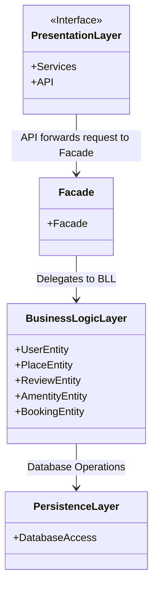
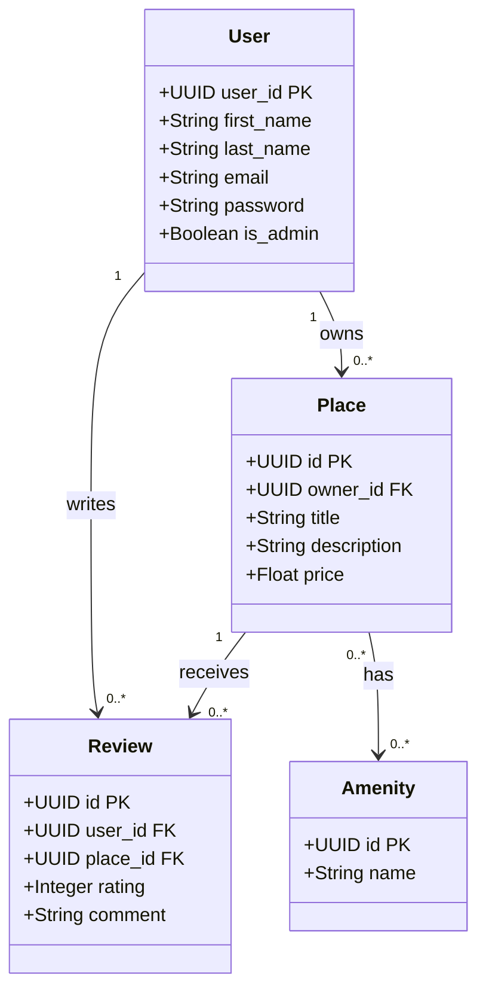
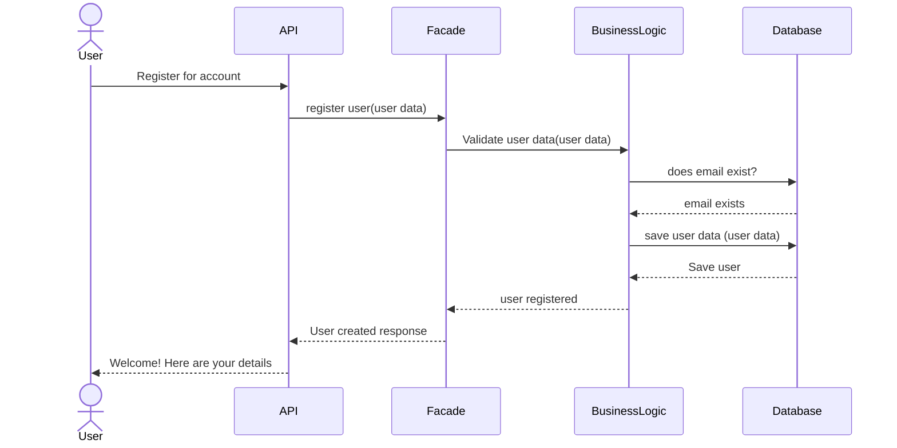
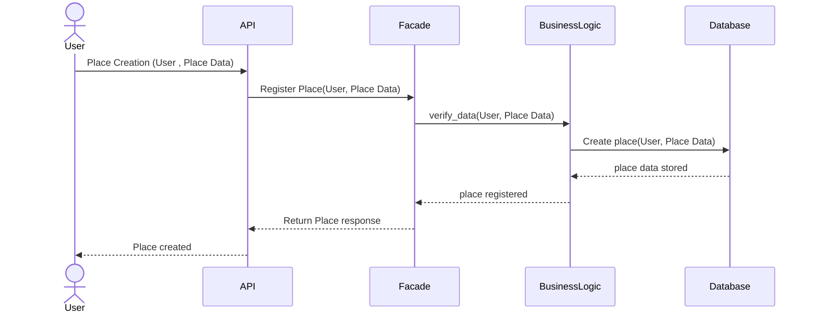
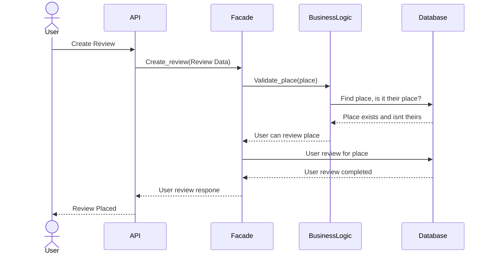
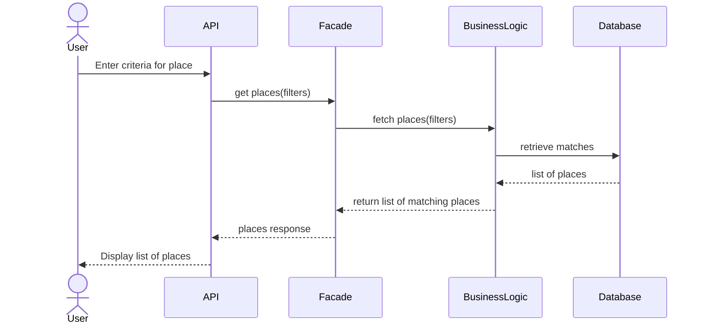

---
### Presentation Layer:
- top layer, contains the API
- only interaction the user has is through this
- sends request to BL and returns failure or success e.g. user clicks edit property, sends request to BL and gets returned sucess or failure
- only talks to the BL, doesnt know of persistence layers existence 

### Business Logic Layer: 
- Holds main Entities
- Holds all the logic and connections between each entity. e.g. only X user edit thise property
- talks to both layers, though only sends requests to persistence if passes logic

### Persistence Layer: 
- handles the connection to database
- deals with all the read and write for the database e.g. changing the values of said property owner wants
- doesnt know of any logic above only does the task given

---

### Facade Pattern:
- Alot of small highly focused code (def for each single task) vs one class doing everything
  

This class diagram shows the Business layer of the HBnB application. It displays the core components of the Business Layer, including User, Place, Review, and Amenities, along with each of their own attributes, methods and relationships respectively.

### User:
- Represents users of the HBnB application.
- Each user contains personal info such as their first and last name, email and password. 
- The is_admin attribute identifies administrative users.
- This class also includes methods for registration, profile updates, and deletion.

### Place:
- Represents properties listed by users.
- Each property includes info such as title, description, price, latitude and longitude.
- A place belongs to a single user and can contain multiple amenities.
- Methods are included for creating, updating, deleting, and listing places.

### Review:
- Represents feedback left by users on places they have stayed at.
- Contains ratings and comments left by customers.
- Each review is associated to one user and one place.

### Amenities:
- Represents features that can be associated with places.
- Can be linked to multiple places.

## Relationships between each entity:

### User & Place:
- One to many relationships exist between User and Place, where one user can own multiple places, but a place only belongs to one user.

### User & Review:
- One to many relationships exist between User and Review. Users can write multiple reviews.

### Place & Review:
- One to many relationships exist between Place and Reviews. A place can receive multiple reviews.

### Place & Amenity:
- Many to many relationships can exist between Place and Amenity. Places can contain multiple amenities, and amenities can also exist between multiple places. Example: Wifi and a Shower can exist at multiple listed places.

Each entity of the Business Layer also have a UUID4 identifier to make sure each attribute/class have uniqueness to them. Attributes such as created_at and updated_at are included to track object creation and modification times.

Overall, these 4 entities collectively makeup the Business Layer of the HBnB application, which also defines how each of these entities interacts within the system.

---
# Sequence diagrams for API calls
Here we have sequence diagrams for 4 different API calls showing how the Presentation layer (API and facade), Business logic layer and the persistence layer (database) communicate with each other

These are:
- User Registration
- Place Creation
- User Review
- Fetching a list of places

## USER CREATION:  

Creation of a new user, The API recevies the registration request and passes that onto the facade. This sends it towards the Business Logic Layer for validation, its will check if the email is unique and doesnt exist with the database if so a user will be created. If email isnt unique will request a new email for the user.

## PLACE CREATION:

Creation of a new place, This follow the same pattern of user creation, the user makes a registration request and passes that onto the facade. This sends it towards the Business Logic Layer to verify the user identity and place data. This is then sent to the database and in return a listing is created.

## USER REVIEW

Creation of a review, the user creates a review and the API recevies a review request. It is then checked through the Business Logic Layer if its the own place, if it isnt the user can review and a review is made directly from the Facade. Otherwise it wont accept a review from user.  

## FETCHING A LIST OF PLACES

Fetching a list of places, this is just a filter, no checks required . It sends a request of places, through the Business Logic layer into the database. Which returns matching places back for it to be displayed for the user.
