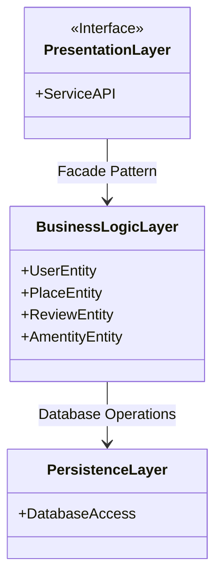

Presentation Layer: 
- top layer, contains the API
- only interaction the user has is through this
- sends request to BL and returns failure or success e.g. user clicks edit property, sends request to BL and gets returned sucess or failure
- only talks to the BL, doesnt know of persistence layers existence 

Business Logic Layer: 
- Holds main Entities
- Holds all the logic and connections between each entity. e.g. only X user edit thise property
- talks to both layers, though only sends requests to persistence if passes logic

Persistence Layer: 
- handles the connection to database
- deals with all the read and write for the database e.g. changing the values of said property owner wants
- doesnt know of any logic above only does the task given
