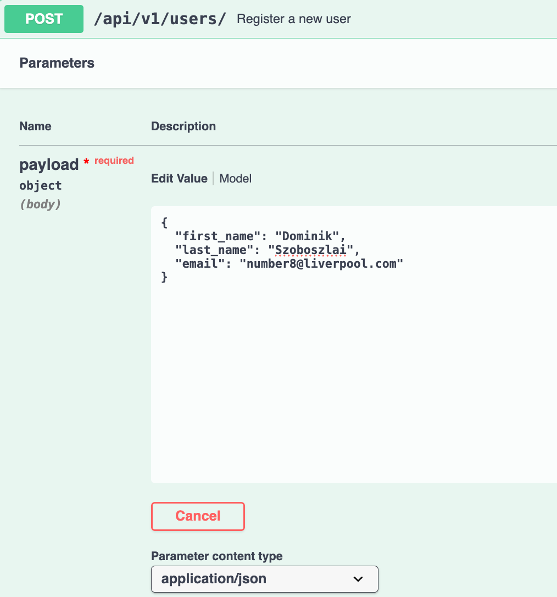

# Business Logic Layer

## Overview

The Business Logic Layer contains the core entities of the HBnB application and implements the business rules of the application. This layer is responsible for managing the four models: Users, Places, Reviews, and Amenities, while also maintaining the relationship between them.

All models inherit from the `BaseModel` class, which provides all common attributes between the models such as uuid, and time stamps.

## BaseModel

The `BaseModel` class serves as the parent class for all models to inherit from and provides the following common attributes:

- `id`: A unique UUID4 identifier
- `created_at`: Date and time the object was created
- `updated_at`: Date and time the object was last modified

## Methods

- `save()`: Updates the 'updated_at' timestamp
- `update(data)`: Updates object attributes from a dictionary and refreshes timestamp

---

## User

`User` represents a user of the HBnB application.

## Attributes

- `first_name`
- `last_name`
- `email`
- `is_admin`
- `places`
- `reviews`

## Responsibilites

- Stores user info
- Registers places under user
- Write reviews under user
- Validates user data such as email format and name length

---

## Place

`Place` model represents a property listing.

## Attributes

- `title`
- `description`
- `price`
- `latitude`
- `longitude`
- `owner`
- `reviews`
- `amenities`

## Responsibilites

- Stores information regarding the place
- Associates a place with an owner
- Maintain reviews and amenities associated with place
- Validates location and pricing information

## Methods

- `add_review(review)`
- `add_amenity(amenity)`

---

## Review

`Review` model represents feedback left by a user for a place.

## Attributes

- `text`
- `rating`
- `place`
- `user`

## Responsibilites

- Store review information
- Associate reviews with users and places
- Validate review ratings

---

## Amenity

`Amenity` model represents a feature available at a place

## Attributes

- `name`

## Responsibilites

- Stores amenity information
- Assocaites amenities with places

---

## Entity Relationships

The Business Logic Layer implements the following relationships:

- One user can own many places
- One user can write many reviews
- One place can have many reviews
- One place can have many amenities
- One review belongs to one user and one place

---

## Usage Examples

### Create a user

user = User(
    first_name="Sam",
    last_name="Lachlan",
    email="anthony@example.com
)

### Create a place

place = Place(
    title="zacshouse",
    description="mansion",
    price=3,
    latitude=11.111,
    longitude= 33.333,
    owner=user
)

### Create a review

review = Review(
    text="wasnt actually that big",
    rating=1,
    place=place,
    user=user
)

### Create an amenity

wifi = Amenity("Wifi")
place.add.amenity(wifi)

### Update an entity

user.update({
    "first_name": "Samuel"
})

---

# Setup and running HBnB

## Clone the repository
```
git clone https://github.com/SamAT01ni/holbertonschool-hbnb.git
```
## Navigate to hbnb
```
cd holbertonschool-hbnb/part2/hbnb
```
## Install the required parts
```
pip install -r requirements.txt
```
## Run the application
```
python3 run.py
```
This starts the api server and it can be accessed on your browser through:\
http://127.0.0.1:5000/api/v1/

You can then try to create users and places yourself using Swagger UI

---

# Using the API

We recommend using swagger ui through the localhost because thats what we used so i cannot really guide you elsewhere\
Going to show you a few examples of how to use the API anyway

Here is a screenshot of how the api should appear


You can play around here and create users, places, amenities and reviews

Its thankfully quite self explanatory and you can find the associated curl commands which are taking place

## Creating a user
Here is an example of how to create a user



Then hit the **execute** button and if you have entered 2 strings and a new email of the right format you will see


