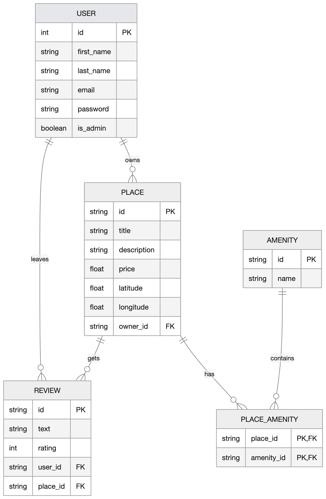

# Welcome to our HBnB readme
> "Glass House. White Ferrari. Live for New Year's Eve. Sloppy steaks at Truffoni's. Big rare cut of meat with water dumped all over it, water splashing around the table, makes the night SO MUCH more fun.
> After the club go to Truffoni's for sloppy steaks. They'd say; 'no sloppy steaks' but they can't stop you from ordering a steak and a glass of water, before you knew it we were dumping that water on those steaks!
> The waiters were coming to try and snatch em up, we had to eat as fast as we could! OHHH I MISS THOSE NIGHTS,
> I *WAS* A PIECE OF SH\*T THOUGH."
---
## Implimented authentication and databases
---

In this section we have implimented several fun features:

- JWT authentication (so we know wo you are [we are DYING to know] )
- User registration and logins with tokens
- Protected endpoints using JWT (we are in control)
- Admin permissions for:
  - Creating new users
  - Modifying users details like email and password
  - Adding new amenities
  - Modifying details of amenities
- User ownership valdiation with JWT to use:
  - Create and own a new place
  - Update your places details
  - Create a review
  - Modify reviews you have made
  - Delete your reviews
- We still have some public endpoints, like retrieving data with GET
- Used SQLAlchemy to make a database

---

## Entity Relation (ER) Diagrams

This diagram maps the relations between the main entitiys


This is just an overview of how our database is linked between each entity. The `||` notation shows a one-to-one elationship and `o{` shows a one to many relationship.

This can also be branched out to show relations for potential new elements that could be added to the application in the future


This shows how reservations would be able to booked and how they would be related to the other entities in the database, where one user can make many reservations, and one place is linked to each reservation.

---
# Setup and running HBnB

## Clone the repository
```
git clone https://github.com/SamAT01ni/holbertonschool-hbnb.git
```
## Navigate to hbnb
```
cd holbertonschool-hbnb/part3/hbnb
```
## Install the required parts
```
pip install -r requirements.txt
```
## Create the database

Open flask shell using
```bash
flask shell
```
# Lachy please step in my king

## Run the application
```
python3 run.py
```
This starts the api server and it can be accessed on your browser through:\
http://127.0.0.1:5000/api/v1/

---

## User

`User` represents a user of the HBnB application.

## Attributes

- `first_name`
- `last_name`
- `email`
- `is_admin`
- `places`
- `reviews`

## Responsibilites

- Stores user info
- Registers places under user
- Write reviews under user
- Validates user data such as email format and name length

---

## Place

`Place` model represents a property listing.

## Attributes

- `title`
- `description`
- `price`
- `latitude`
- `longitude`
- `owner`
- `reviews`
- `amenities`

## Responsibilites

- Stores information regarding the place
- Associates a place with an owner
- Maintain reviews and amenities associated with place
- Validates location and pricing information

## Methods

- `add_review(review)`
- `add_amenity(amenity)`

---

## Review

`Review` model represents feedback left by a user for a place.

## Attributes

- `text`
- `rating`
- `place`
- `user`

## Responsibilites

- Store review information
- Associate reviews with users and places
- Validate review ratings

---

## Amenity

`Amenity` model represents a feature available at a place

## Attributes

- `name`

## Responsibilites

- Stores amenity information
- Assocaites amenities with places

---

## Entity Relationships

The Business Logic Layer implements the following relationships:

- One user can own many places
- One user can write many reviews
- One place can have many reviews
- One place can have many amenities
- One review belongs to one user and one place

---

# Using the API

***You must not create anything machester united or arsenal related or there will be consequences***
