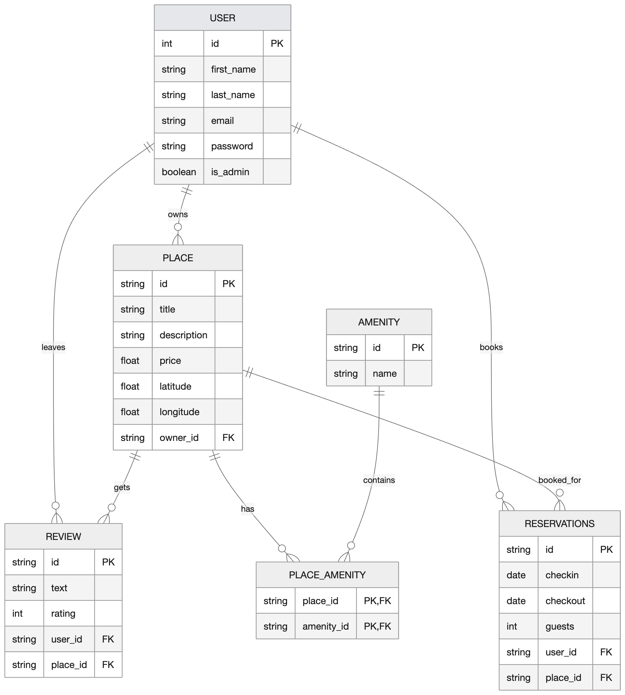

# Welcome to our HBnB readme
> "Glass House. White Ferrari. Live for New Year's Eve. Sloppy steaks at Truffoni's. Big rare cut of meat with water dumped all over it, water splashing around the table, makes the night SO MUCH more fun.  
> After the club go to Truffoni's for sloppy steaks. They'd say; 'no sloppy steaks' but they can't stop you from ordering a steak and a glass of water, before you knew it we were dumping that water on those steaks!  
> The waiters were coming to try and snatch em up, we had to eat as fast as we could! OHHH I MISS THOSE NIGHTS,  
> I *WAS* A PIECE OF SH\*T THOUGH."
> - *Tim Robinson*
---
## Implimented authentication and databases
---

In this section we have implimented several fun features:

- JWT authentication (so we know wo you are [we are DYING to know] )
- User registration and logins with tokens
- Protected endpoints using JWT (we are in control)
- Admin permissions for:
  - Creating new users
  - Modifying users details like email and password
  - Adding new amenities
  - Modifying details of amenities
- User ownership valdiation with JWT to use:
  - Create and own a new place
  - Update your places details
  - Create a review
  - Modify reviews you have made
  - Delete your reviews
- We still have some public endpoints, like retrieving data with GET
- Used SQLAlchemy to make a database

---

## Entity Relation (ER) Diagrams

This diagram maps the relations between the main entitiys


This is just an overview of how our database is linked between each entity. The `||` notation shows a one-to-one elationship and `o{` shows a one to many relationship.

This can also be branched out to show relations for potential new elements that could be added to the application in the future



This shows how reservations would be able to booked and how they would be related to the other entities in the database, where one user can make many reservations, and one place is linked to each reservation.

One thing to note, when the entities User, Review, Place and Amenity are committed to the database, because they all derive from the BaseClass they are entered with utcnow data (date-a if you will) so in the database there are 2 extra columns for created_at and updated_at which get automatically inserted as you post or update these entities.

---

# Setup and running HBnB

## Clone the repository
```
git clone https://github.com/SamAT01ni/holbertonschool-hbnb.git
```
## Navigate to hbnb
```
cd holbertonschool-hbnb/part3/hbnb
```
## Install the required parts
```
pip install -r requirements.txt
```

## Run the application
```
python3 run.py
```
This starts the api server and it can be accessed on your browser through:\
http://127.0.0.1:5000/api/v1/
---

```
python3 -m flask shell
```

This allows you to enter the flask shell and interact with it directly, or using curl to push though curl commands with an admin token.

in sqlpop we have dbInit.py, by running this you will create an example database, insert 3 amenities and create an admin named Admin HbnB. Then do CRUD operations, this demonstrates how the functionaily of the database will work without affecting the actual database.

to run this database creation/intialzation/crud:
```
python3 dbInit.py
```
## User

`User` represents a user of the HBnB application.

## Attributes

- `first_name`
- `last_name`
- `email`
- `is_admin`
- `places`
- `reviews`

## Responsibilites

- Stores user info
- Registers places under user
- Write reviews under user
- Validates user data such as email format and name length

---

## Place

`Place` model represents a property listing.

## Attributes

- `title`
- `description`
- `price`
- `latitude`
- `longitude`
- `owner`
- `reviews`
- `amenities`

## Responsibilites

- Stores information regarding the place
- Associates a place with an owner
- Maintain reviews and amenities associated with place
- Validates location and pricing information

## Methods

- `add_review(review)`
- `add_amenity(amenity)`

---

## Review

`Review` model represents feedback left by a user for a place.

## Attributes

- `text`
- `rating`
- `place`
- `user`

## Responsibilites

- Store review information
- Associate reviews with users and places
- Validate review ratings

---

## Amenity

`Amenity` model represents a feature available at a place

## Attributes

- `name`

## Responsibilites

- Stores amenity information
- Assocaites amenities with places

---

## Entity Relationships

The Business Logic Layer implements the following relationships:

- One user can own many places
- One user can write many reviews
- One place can have many reviews
- One place can have many amenities
- One review belongs to one user and one place

---

# Using the API

## Create the database and admin in flask

Firstly open `flask shell` methods such as `python3 -m flask shell` work, next enter this code:

```python
from app import db
db.create_all()
from app.models.user import User
admin = User(
    id="36c9050e-ddd3-4c3b-9731-9f487208bbc1",
    first_name="Jon",
    last_name="Clus",
    email="admin@hbnb.com",
    is_admin=True
)
admin.hash_password("password")
db.session.add(admin)
db.session.commit()
```
This has created the tables in the database, and created the admin

We chose the password to be password because i thought it was funny


exit out of the flask shell with `quit()`

## Log in as the admin

Bonjour Jon, time to use your admin privileges (for good, preferably)
Use curl to use the login endpoint
```bash
curl -X POST http://127.0.0.1:5000/api/v1/auth/login \
-H "Content-Type: application/json" \
-d '{
  "email": "admin@hbnb.com",
  "password": "password"
}'
```

This will return you with an "access token" which you must use for any endpoints where authorisation is required
```bash
    "access_token": "eyJhbGciOi..."
```

## Create a new user

Well Jon, youre in! Time to fill up our small little world, shall we? Who does your heart desire to make?

Well, I am here from the past so i shall make your decision for you. We shall make the last great Frenchman (other than yourself)
```bash
curl -X POST http://127.0.0.1:5000/api/v1/users/ \
-H "Content-Type: application/json" \
-H "Authorization: Bearer [admin access code here]" \
-d '{
  "first_name": "Dom",
  "last_name": "Perignon",
  "email": "dommy@champagne.com",
  "password": "monkwine123"
}'
```
This will return this information as well as a user id
While we're still logged in as Jon, we can make a couple of amenities to add to our future château.

## Create amenities

```bash
curl -X POST http://127.0.0.1:5000/api/v1/amenities/ \
-H "Content-Type: application/json" \
-H "Authorization: Bearer [admin access token]" \
-d '{
  "name": "Cellar"
}'
```
```bash
curl -X POST http://127.0.0.1:5000/api/v1/amenities/ \
-H "Content-Type: application/json" \
-H "Authorization: Bearer [admin access token]" \
-d '{
  "name": "Old monks"
}'
```
This will return the name of the amenity as well as its amenity id

## Making Dom's wine haven

Tres bien. Log in as Dom using the log in method as shown before but with our monastic friend's credentials which will return an access token for him, and lets get posting a location
```bash
curl -X POST http://127.0.0.1:5000/api/v1/places/ \
-H "Content-Type: application/json" \
-H "Authorization: Bearer [Dom's access token]" \
-d '{
  "title": "Abbaye Saint-Pierre d'Hautvillers",
  "description": "Weird church where Dom refined his blending skills. Don't mind the monks!",
  "price": 180,
  "latitude": 49.081,
  "longitude": 13.941,
  "amenities_id": [
    "[Cellar amenity_id]",
    "[Old monk amenity_id]",
  ]
}'
```
And look, now we have an abbey thats linked to Dom Perignon and its place id.

## Extra examples of what you can do

You can also use `PUT` to update information (if you have the right permissions) so if dom wants to update the abbey, you can use:
```bash
curl -X PUT http://127.0.0.1:5000/api/v1/places/PLACE_ID_HERE \
-H "Content-Type: application/json" \
-H "Authorization: Bearer [owner or admin access token]" \
-d '{
  "title": "Abbaye Saint-Pierre d'Hautvillers",
  "description": "Dom died, the building is in disrepair",
  "price": 2
}'
```

And if you wanted to leave a review, log back in as Jon (you cannot leave a review on a place that you own) and drop one!
```bash
curl -X POST http://127.0.0.1:5000/api/v1/reviews/ \
-H "Content-Type: application/json" \
-H "Authorization: Bearer [non-owner access token]" \
-d '{
  "text": "Wine was good, place felt cold, i tasted the stars",
  "rating": 4,
  "place_id": "PLACE_ID_HERE"
}'
```
---
# Authors

### This has been a '4 in a Bed at the HBnB' production brought to you by:

- Anthony Joy
- Zac Malkoun
- Lachlan McKenna
- Sam Thompson

Go pies, C'mon Liverpool, hope england use yadda yadda yadda,
***You must not create anything machester united or arsenal related or there will be consequences***
